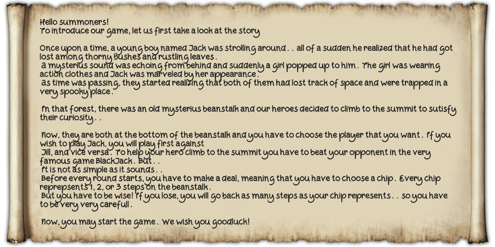

# Black-Jack

## Description 📌
Black-Jack-and-Jill is a variation of the classic Black Jack game developed in C++ using the <a href="https://cgaueb.github.io/sgg/index.html">SGG (Simple Game Graphics)</a> Library. It is a 2 player game, played on a single computer.

    

    <h3>BlackJack Rules<h3>

- Click on the deck to hit a card and then, drag and drop it to your hand. Your score will then be increased by the value of the card you just got.

- Keep in mind that aces count as 11 or 1, according to what optimizes your hand! 

- The player has 2" to take a look at their cards before they are faced down until their next turn. This is done so that the other player have not enough time to peek (as the game is played on a single machine).

- Should you decide not to hit another card stand right after you drew a card or else you will have to hit again!

- Round immediately ends if a player has <i>BlackJack</i> (fisrt 2 cards are ace & any card counting as 10) or their score is 21. Also if a player keeps hitting cards and exceeds the limit of 21, then round ends to the favor of the other player. Otherwise round ends when both players hit stand and the winner is the player with the greatest score.

- <i>BlackJack's</i> value exceeds any other hand.

## Play the Game 💻
1. Clone the repository locally.
2. Go to <i>/BlackJack/Game/bin</i>
3. Double click on the <i>BlackJack.exe</i> file.
4. The game has started, wait until it loads, make it full screen and have fun!

## Implementation Details 📜

#### ● Main (draw, update)

#### ● Structure
The implementation follows an object oriented approach and highlights the good practises of inheritance and polymorphism, as it becomes evident below:

.png>)

#### ● Animations
All animations are implemented as subclasses of an Event superclass (Event.cpp, Event.h). The interesting part is that animations don't use any video or multiple pictures, but they are based on a rather mathematical approach.  
Each Event has the following attributes:

- coordinates (the exact position on screen where it will appear)	
- duration
- elapsed time
- delay (if the event starts immediately after being active, delay is set to 0)
- elapsed delay
- active flag (a boolean that indicates if the event is active or not)			

and each subclass inherits those attributes. 
Some noteworthy techniques used that are dependent on those attributes are:
- The <b>Player's motion</b>: Used when the players climb the beanstalk moving form one level to another. Langrange Interpolation is used to calculate the points of the curve that the player's image follows during the jumps. (Every curve is different because the player moves up or down and the steps they make are determined from the chips). 
- The <b>Card's motion</b>: When the player lets down a card that has drawn from the deck, the card is seen go back to the deck smoothly. This is achieved through linear interpolation.
- <b>Image scale increase or reduction</b>: This is done by tuning the scale using the completion rate of the Event (elapsed time/ duration).
- <b>Fading in or out</b>: This is achieved by tuning the opacity using the completion rate of the Event (elapsed time/ duration).

💡 To manage these events, a list of event pointers is maintained. The list is refreshed every frame, updating events' elapsed time and removing inactive ones.
---

<i>Note:</i> The code has been checked for memory leaks. ✔️
